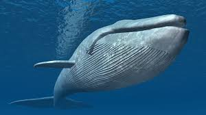
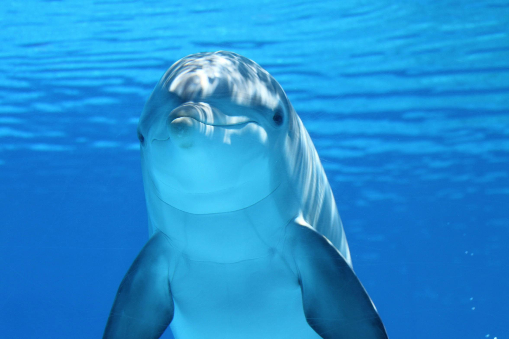
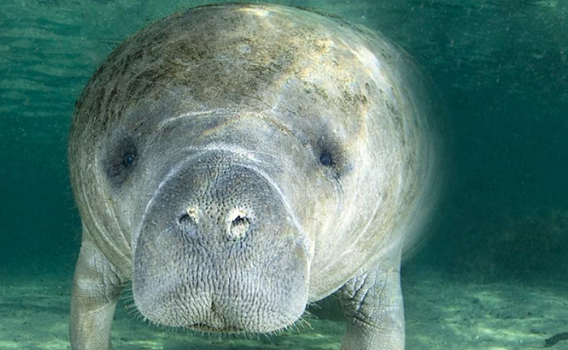
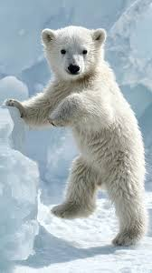
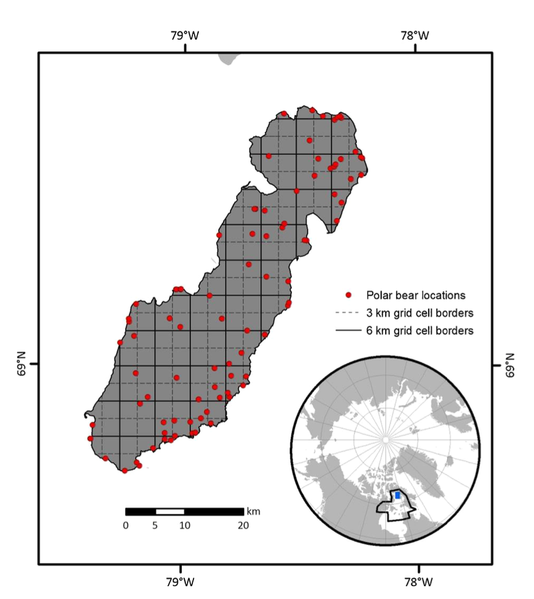

# **Mamiferos marinos**
¿Qué mejor que aprender acerca de los animales más divertidos del planeta? El grupo de los arrepentidos, de los diferentes, ¿por que seguir viviendo la tierra si es más divertido apelar a tus antepasados y nadar como un pez?

## ¿Qué es un mamífero marino?
En general los mamíferos marinos son animales que viven, se reproducen y pasan gran parte o toda su vida en el **agua de mar o agua salada**, aquí recae un punto importante puesto que excluimos a lso animales pese a vivir en agua o depender fuertemente de esta y que se relacionan más con el agua dulce.

* Por ejemplo, estos serían animales marinos:
  * La ballena azul: *Balaenoptera musculus*.
   * 
  * El delfin nariz de botella: *Tursiops truncatus*.
   * 
  * El manatí: *Trichechus manatus*.
   *  
  * El oso polar: *Ursus maritimus*.
   *   

### *Por otro lado, aniamles que NO son mamíferos marinos son (~mamífero marino~)*:
 *El pinguino emperador: _Aptenodytes forsteri_.
 *Tortuga verde marina: _Chelonia mydas_.

##Definiendo a los mamíferos marinos
Viendoe stos ejemplo podemos identificar ciertas características compartidas de los mamíferos marinos:
1. ¿Cómo repsira?
    1.  Respiran aire por tanto tienen pulmones y no branquias como los peces.
    1.  Al vivir en el agua pero rspirar aire en casi todos los casos necesitan salir a la superficie a respirar aire, sea cada pocos minutos o cada par de horas.
2. Amamantan a sus crías con leche.
   1. Dado que siguen siendo mamíferos preservan su rasgo distintivo, tienen glandulas mamarias que dan leche a las crias.
3. Son de sangre caliente.
4. Tienen un sistema nervioso desarrollado y en muchos casos presentan gran inteligencia, comportamiento de grupo e incluso cultura y sistemas de comunicación avanzada (orcas).

## **En el limite de los animales marinos:_Ursus maritimus_** 
El oso polar es un caso muy particular, esta al borde entre ser un animal marino y un oso normal, se podría clasificar como un animal terrestre altamente especializado que depende mucho de los recursos del mar para su alimeintación, supervivencia y reproducción.

## **¿Cómo obtener información fácilmente de un animal que tiene un espacio de vida tan amplio como el óceano? Un ejemplo de osos polares aplicable a cualquier animal marino...**

En [LaRue et al. (2015)](archivos/larue2015.pdf) encontramos una aproximación teórico-práctica para el rastreo satelital y cuantificación de animales, enfocado en el caso de los osos polares en la isla Rowley en el Ártico canadiense, mostrando que la técnica de diferenciación de imágenes, en la cual se sobreponen dos imágenes de diferente marco temporal del mismo, logra contribuir a la ubicación espacial de los osos polares en la isla. Lo anterior es muy útil y puede ser potenciado por otros modelos de machine learninn e inteligencia artifical pues permite estudiar zonas remotas donde viven animales de amplio rango de movimiento y con la posiblidad de evitar perturbar sus ambientes.
Es te es un enfoque muy interesante pues para animales como ballenas, orcas u otros mamíferos marinos que son de un tamao considerable y que pueden recorrer grandes distancias en el óceano permite inferir sis movimientos y establecer rutas de movimiento a bajo costo con repositorios de imágenes de satelite e imágenes en tiempo real de estos mismos.

En el siguiente mapa podemos observar uno de lso resultados que obtuvo el autor, donde se observan dos diferentes grillas (3 y 6 km) y la ubicación detectada de 90 posibles osos polares, es muy importante este resultado pues pese a que los osos polares y su ambiente nos podrían parecer de igual color para el algoritmo existen pequeñas diferencias que son explotadas para localizarlos, aprender y corregir la identificación y ubicarlos con un buen nivel de confianza.

## Otro tema importante de tratar es la abundancia de algunos mamíferos marinos
* A continuación se presenta una tabla que indica el posible número de individuos de algunas especies de mamíferos marinos.

Nombre común | Posible abundancia
-------|-----------
Ballena azul| 17500
Delfin nariz de botella| 600000
Foca común| 500000
Manatí| 13000
Oso Polar| 27000
